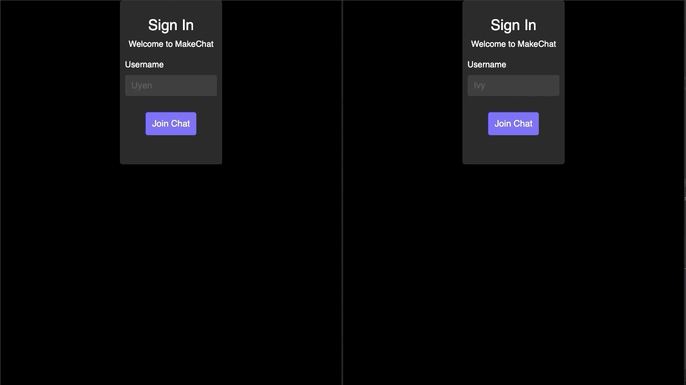

# MakeChat

MakeChat is a realtime messaging application using Socket.io, jQuery, Node.js and Express.js with client-side Javascript.



## Installation

Use the package manager [npm](https://docs.npmjs.com/) to install MakeChat.

```bash
npm install
```

## Usage

```python
import foobar

foobar.pluralize('word') # returns 'words'
foobar.pluralize('goose') # returns 'geese'
foobar.singularize('phenomena') # returns 'phenomenon'
```

## Contributing
Pull requests are welcome. For major changes, please open an issue first to discuss what you would like to change.
